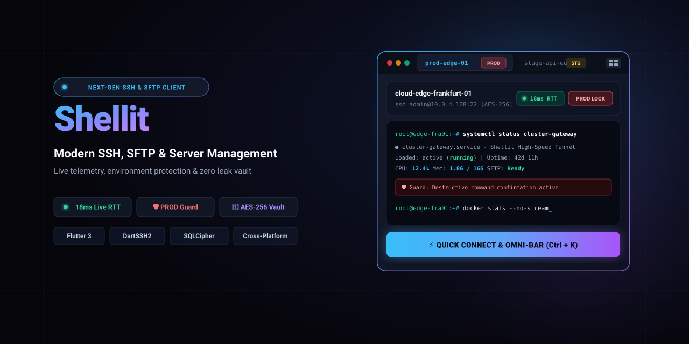

<p align="center">
  
</p>

# Shellit ⚡

> **Современный, безопасный и кроссплатформенный SSH-клиент, SFTP-менеджер и центр управления серверами нового поколения, созданный на Flutter & Dart.**

[](https://flutter.dev)
[](https://dart.dev)
[](docs/AGENTS_MASTER_GUIDE.md)
[](system-context.md)
[](LICENSE)

---

## 📖 О проекте

**Shellit** объединяет удобство лучших инструментов управления инфраструктурой и бескомпромиссную безопасность. Приложение разработано как независимый инструмент разработчика и сисадмина с фокусом на производительность, изоляцию архитектуры и максимальную прозрачность соединений.

В отличие от стандартных терминалов, Shellit предоставляет наглядную телеметрию состояния серверов в реальном времени, защиту от случайных деструктивных действий в продакшене и расширяемую систему плагинов.

---

## ✨ Ключевые возможности (Shellit Identity)

- 🔄 **Self-Hosted Zero-Knowledge E2EE Sync (Своя синхронизация на VPS):**
  Синхронизация хостов, ключей, сниппетов и папок между всеми устройствами (Windows, macOS, Linux, Android, iOS) через ваш собственный ультралегкий сервер на VPS. Данные шифруются на клиенте через **Argon2id** и **AES-256-GCM**. Сервер никогда не видит ваших паролей и ключей. Поддерживает чистый HTTP (внутри WireGuard / Tailscale / LAN) и самоподписанные SSL-сертификаты.

- 🟢 **Live Host Telemetry (Живой пинг серверов):**
  Индикация RTT-задержки прямо на карточках хостов (`<50ms` — зеленый, `<200ms` — желтый, оффлайн — серый). Состояние серверов видно еще до установки соединения.

- 🛡️ **Environment Protection & PROD Guard (Защита окружений):**
  Цветные бейджи для каждого сервера (`PROD` — тревожный красный, `STAGE` — предупреждающий желтый, `DEV` — спокойный синий). На серверах с тегом `PROD` включается красная защитная рамка, а опасные команды (`rm -rf`, `DROP`, `reboot`, fork-бомбы) перехватываются окном подтверждения.

- ⚡ **Omni-Bar (`Ctrl+K` / `Cmd+K`):**
  Универсальная командная строка в духе Raycast/Spotlight: мгновенный поиск хостов, запуск сниппетов, смена тем оформления и управление лейаутами без отрыва рук от клавиатуры.

- 🪟 **Matrix Tiling Splits & Drag & Drop:**
  Гибкое разделение рабочего пространства терминала (горизонтальное, вертикальное, сетка 2x2) внутри вкладок, перетаскивание открытых сессий мышкой в пустые слоты и режим широковещательного ввода (**Broadcast Input**) сразу во все активные сплиты.

- 📂 **Two-Pane SFTP Manager (Двухпанельный менеджер файлов):**
  Полноценный файловый менеджер во вкладке сессии: локальная файловая система слева, удаленный сервер справа, drag-and-drop передача файлов, контекстные меню, графический редактор прав доступа (chmod) и фоновая очередь задач.

- 📜 **Asciinema Session Recording & Audit (Запись сессий):**
  Встроенная запись терминальных сессий в стандарте **asciinema v2 (`.cast`)** и текстовые логи (`.log`). Автоматическая запись для PROD-серверов, живой тикающий индикатор `● REC` в тулбаре и двухвкладочный экран журнала диагностики.

- ⚡ **Command Snippets (Быстрые сниппеты):**
  Библиотека часто используемых команд с поиском по тегам, 1-click отправкой в активный шелл и мгновенным вызовом через Omni-Bar (`Ctrl+K`).

- 🗂️ **Multi-View Catalog:**
  Мгновенное переключение между режимами каталога: плиточная сетка (Grid), плотный список для 50+ серверов (Dense List) и иерархическое дерево папок (Folder Tree).

- 🔐 **Zero Credentials Leakage & SQLCipher Vault:**
  Локальная база данных зашифрована через **AES-256 (SQLCipher)**. Мастер-пароль защищен деривацией ключа **Argon2id**. Строгий протокол очистки оперативной памяти (Zeroize) после закрытия сессий и санитизация логов.

- 🧩 **Open Desktop Plugin SDK:**
  Расширение возможностей приложения кастомными плагинами (`.shellit`) через изолированный WebView IPC-мост на десктопных платформах.

---

## 🏛 Архитектура монорепозитория

Проект построен по модульной архитектуре с соблюдением принципа слабой связанности (Contract-First) и изоляции пакетов:

```text
Shellit/
├── apps/
│   └── shellit/                    # Главное Flutter-приложение (DI, Riverpod, Routing, Run)
├── packages/
│   ├── core_foundation/            # Чистые доменные сущности, Result/Failure, контракты/интерфейсы
│   ├── storage_vault/              # Зашифрованное хранилище (Drift + SQLCipher, Argon2id, SyncCrypto)
│   ├── ssh_network_core/           # Сетевое ядро (dartssh2, PTY-потоки, SFTP-клиент, туннели, рекордер)
│   ├── terminal_ui/                # Эмулятор терминала (xterm.dart, табы, сплиты, мобильная панель)
│   └── desktop_plugin_sdk/         # Спецификация манифестов плагинов, валидатор и песочница IPC
├── servers/
│   └── sync_server/                # Легковесный сервер синхронизации (Dart + SQLite, Docker, <20MB RAM)
└── docs/                           # Центр координации и документации проекта
```

> **Правило изоляции:** Любой пакет зависит *только* от абстракций `packages/core_foundation/`. Прямые перекрестные зависимости между фича-пакетами запрещены.

---

## 🚀 Быстрый старт

### Требования
* **Flutter SDK**: `>= 3.12.0`
* **Dart SDK**: `>= 3.12.0`
* Поддерживаемые десктопные среды: Windows 10/11, macOS (12+), Linux (Ubuntu 22.04+ / Debian / Fedora)

### 1. Клонирование и получение зависимостей

```bash
# Клонирование репозитория
git clone https://github.com/your-org/shellit.git
cd Shellit

# Получение зависимостей основного приложения
cd apps/shellit
flutter pub get
```

### 2. Запуск приложения

```bash
# Windows
flutter run -d windows

# macOS
flutter run -d macos

# Linux
flutter run -d linux
```

### 3. Запуск тестов и статического анализа

```bash
# Анализ кода по всему проекту
flutter analyze

# Запуск тестов
flutter test
```

---

## ☁️ Собственный сервер синхронизации (Self-Hosted Sync)

Shellit не привязывает вас к проприетарным платным облакам. Вы можете развернуть собственный легковесный сервер синхронизации на любом домашнем сервере или VPS всего за 60 секунд.

### 🛡️ Архитектура Zero-Knowledge
* **Клиентское шифрование:** Все хосты, приватные ключи, сниппеты и папки шифруются алгоритмом **AES-256-GCM**. Ключ деривируется из вашей кодовой фразы (Passphrase) через **Argon2id**.
* **Слепой сервер:** На сервер отправляется только слепой хэш `authHash` и зашифрованные бинарные строки. Владелец сервера не может прочитать даже названия хостов.
* **Tombstones & LWW:** Удаления отслеживаются «надгробиями», а конфликты разрешаются по правилу Last-Write-Wins (Pull-Then-Push).
* **Свобода транспорта:** Сервер работает как по чистому `http://` (внутри WireGuard, Tailscale или домашней сети без возни с доменами и SSL), так и по `https://` (включая самоподписанные сертификаты).

### 🚀 Запуск на сервере через Docker Compose

1. Скопируйте папку сервера или создайте `docker-compose.yml` на вашем VPS:

```yaml
version: '3.8'

services:
  shellit-sync:
    build: ./servers/sync_server
    container_name: shellit-sync
    restart: unless-stopped
    ports:
      - "8080:8080"
    volumes:
      - ./data:/data
    environment:
      - PORT=8080
      - HOST=0.0.0.0
      - DATA_PATH=/data/shellit-sync.db
      - REGISTRATION_TOKEN=super-secret-invite-token # Опционально: защита от чужих регистраций
```

2. Запустите:
```bash
docker compose up -d
```

### 📱 Подключение в приложении Shellit

1. Перейдите в **Settings → Sync & Cloud**.
2. Укажите:
   * **Server URL:** `http://<ip-вашего-vps>:8080` или `https://sync.your-domain.com`.
   * **Vault ID:** Идентификатор хранилища (например, `my-servers`).
   * **Sync Passphrase:** Кодовая фраза шифрования (запомните её для других устройств).
   * **Registration Token:** Токен регистрации (если задан в `REGISTRATION_TOKEN` на сервере).
   * При использовании самоподписанного сертификата включите **«Allow self-signed SSL / insecure HTTP»**.
3. Нажмите **Test Connection**, затем **Sync Now**.
4. Повторите шаг на телефоне или втором компьютере — и ваша инфраструктура синхронизирована!

Подробная документация: [`servers/sync_server/README.md`](servers/sync_server/README.md).

---

## 📚 Документация и разработка

Все процессы разработки, спецификации и задачи зафиксированы в директории [`docs/`](docs/):

* [`docs/AGENTS_MASTER_GUIDE.md`](docs/AGENTS_MASTER_GUIDE.md) — Мастер-руководство по архитектуре и стандартам кода.
* [`docs/ROADMAP.md`](docs/ROADMAP.md) — Дорожная карта и контрольные точки (Milestones).
* [`docs/CHECKLIST.md`](docs/CHECKLIST.md) — Интерактивный трекер задач по пакетам.
* [`docs/BUGS_AND_ISSUES.md`](docs/BUGS_AND_ISSUES.md) — Реестр инцидентов и баг-трекер.
* [`docs/CHRONICLE.md`](docs/CHRONICLE.md) — Летопись разработки и инженерный дневник проекта.
* [`GEMINI.md`](GEMINI.md) — Системные инструкции для AI-ассистентов.

---

## 🔒 Безопасность

* **Zero Hardcoded Secrets**: Никогда не сохраняйте учетные данные или приватные ключи в кодовой базе.
* **Master Vault**: Приватные ключи и пароли шифруются локально. Без мастер-пароля расшифровка базы математически невозможна.
* **Memory Hygiene**: Чувствительные данные обнуляются (`zeroize`) сразу после использования в сессии.

---

## 📄 Лицензия

Проект распространяется под свободной копилефтной лицензией **[GNU General Public License v3.0 (GPLv3)](LICENSE)**.

### Что это означает (свобода с ограничениями):
* ✅ **Свобода использования:** вы можете бесплатно запускать и использовать Shellit для любых целей, включая личные и коммерческие задачи администрирования серверов.
* ✅ **Свобода изучения и доработки:** исходный код полностью открыт, доступен для аудита, изменения и расширения.
* ⚠️ **Ключевые ограничения (Строгий Copyleft):**
  * **Обязательное сохранение свободы:** любые форки, модификации или производные продукты обязаны распространяться под той же лицензией GPLv3 и с полностью открытым исходным кодом.
  * **Запрет на закрытие кода:** запрещено включать компоненты ядра Shellit в закрытые проприетарные продукты без раскрытия исходного кода.
  * **Сохранение авторства:** обязательно сохранение всех уведомлений об авторских правах и текста лицензии.
