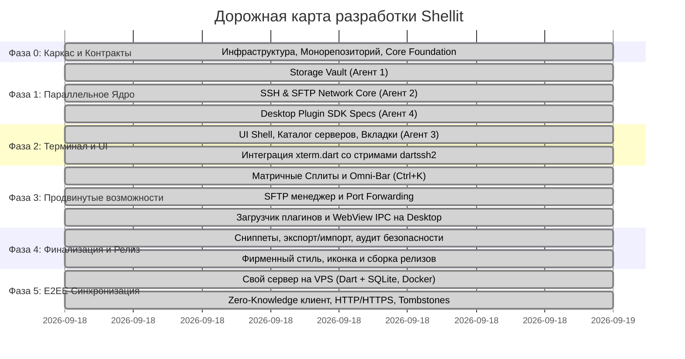

# Дорожная карта разработки Shellit (Roadmap)

В данном документе зафиксированы ключевые фазы разработки, контрольные точки (Milestones) и критерии приемки.

---

## График фаз

---

## Детализация по фазам

### Фаза 0: Инициализация, архитектурный каркас и контракты (День 1)
* **Цель:** Подготовить проектную инфраструктуру для полной изоляции параллельной разработки 4 агентов.
* **Результаты:**
  1. Развернута система документации (`docs/`).
  2. Создан монорепозиторий с пакетом `core_foundation`.
  3. Описаны все абстрактные интерфейсы (`IHostRepository`, `IKeyManager`, `ISshClientService`, `ITerminalSession`, `IPluginLoader`).
* **Критерий приемки (Milestone 0):** `flutter analyze` и `dart test` в `core_foundation` проходят без ошибок.

---

### Фаза 1: Параллельная разработка ядра (Дни 2–3)
* **Агент 1 (`storage_vault`):**
  * Развертывание Drift + SQLCipher.
  * Реализация Argon2id деривации мастер-пароля.
  * Репозитории для хостов, папок, сниппетов, ключей.
  * Юнит-тесты шифрования и миграций.
* **Агент 2 (`ssh_network_core`):**
  * Интеграция `dartssh2`.
  * Аутентификация по паролю и ключам Ed25519/RSA.
  * Провайдер PTY потоков и обработка ресайза.
  * Базовый SFTP клиент.
* **Агент 4 (`desktop_plugin_sdk`):**
  * Спецификация манифеста и парсер `.shell-plugin`.
  * Песочница с JSON-RPC мостом для десктопа.
* **Критерий приемки (Milestone 1):** Пакеты `storage_vault` и `ssh_network_core` покрыты изолированными тестами.

---

### Фаза 2: Терминальный UI и интеграция (Дни 3–4)
* **Агент 3 (`terminal_ui`):**
  * Верстка главного окна Shellit (сайдбар, строка быстрого коннекта, карточки серверов с индикатором RTT пинга и бейджами окружений).
  * Интеграция `xterm.dart`.
  * Соединение потоков `ITerminalSession` (Агент 2) с терминальным виджетом.
  * Подключение базы данных (Агент 1) к списку хостов.
* **Критерий приемки (Milestone 2):** Приложение запускается на Windows/macOS/Linux, открывает зашифрованное хранилище по мастер-паролю и успешно подключается по SSH к тестовому серверу с выводом в терминал.

---

### Фаза 3: Продвинутые возможности и плагины (День 5)
* **Сплит-скрин (Tiling Manager):** Вертикальные, горизонтальные сплиты, сетка 2x2.
* **Omni-Bar (`Ctrl+K`):** Быстрый командный поиск серверов, сниппетов и действий.
* **SFTP UI:** Двухпанельный или вкладочный проводник файлов.
* **Port Forwarding:** Интерфейс создания локальных/удаленных туннелей.
* **Интеграция плагинов:** Загрузка и рендеринг плагинов в сайдбаре десктопа.
* **Критерий приемки (Milestone 3):** Работающий SFTP, активный туннель портов, запуск тестового плагина в десктопной версии.

---

### Фаза 4: Синхронизация, брендинг и релиз (Дни 6–7)
* **Мобильная адаптация:** Нижняя навигация, кастомная панель спецклавиш (Esc, Tab, Ctrl, стрелки) для iOS/Android с виброоткликом.
* **Экспорт/Импорт:** Зашифрованный бэкап базы данных (контейнер `.shellit-vault` + AES-GCM + Argon2id с отдельным ключом экспорта).
* **Системные логи и запись сессий:** Двухвкладочный `AuditLogsScreen`, очистка ANSI, запись в формате `asciinema` v2 (`.cast`) и текстовых логов (`.log`).
* **Аудит безопасности и Zeroize:** Проверка утечек ключей и паролей в памяти.
* **Фирменный стиль и кроссплатформенные ассеты:** Векторный логотип `S_`, виджет `ShellitLogo`, мультиразрешенный `app_icon.ico` (16–256 px), `mipmap` Android, `AppIcon.appiconset` macOS/iOS, Web PWA.
* **Релизные пайплайны:** Сборка оптимизированного релизного пакета Windows (`build\windows\x64\runner\Release\shellit.exe` с Safe Build Protocol).
* **Критерий приемки (Milestone 4 — Release 1.0.0 Ready):** [x] Стабильный релиз Windows скомпилирован со вшитой новой иконкой, 194 теста монорепозитория успешно пройдены, 0 ошибок анализатора.

---

### Фаза 5: Кроссплатформенная синхронизация (Self-Hosted Zero-Knowledge E2EE)
* **Цель:** Обеспечить мгновенную и безопасную синхронизацию серверов, ключей, папок и сниппетов между всеми устройствами (Windows, macOS, Linux, Android, iOS) через собственный легковесный сервер на VPS без зависимости от сторонних облаков.
* **Результаты:**
  1. Автономный сервер синхронизации `servers/sync_server` (Dart + SQLite, Docker / Compose, REST API + WebSocket, потребление RAM < 20 МБ).
  2. Zero-Knowledge E2EE криптография (`SyncCrypto`): Argon2id деривация ключей, SHA-256 blind auth token, AES-256-GCM шифрование полезной нагрузки на стороне клиента. Сервер хранит только зашифрованные блобы.
  3. Надежное бесконфликтное слияние: таблица надгробий (`SyncTombstonesTable`) в Drift и алгоритм Pull-Then-Push с Last-Write-Wins (LWW).
  4. Поддержка не только HTTPS (включая самоподписанные сертификаты без ошибок), но и чистого HTTP для работы внутри WireGuard, Tailscale и локальных сетей без возни с доменами и Let's Encrypt.
  5. Экран настроек `SyncSettingsCard` в `apps/shellit` со статусом в реальном времени и ручным/автоматическим триггером синхронизации.
* **Критерий приемки (Milestone 5):** [x] Все сквозные мульти-клиентские интеграционные тесты пройдены (ноутбук ↔ сервер ↔ телефон), 0 ошибок анализатора, Dockerfile готов к деплою.

