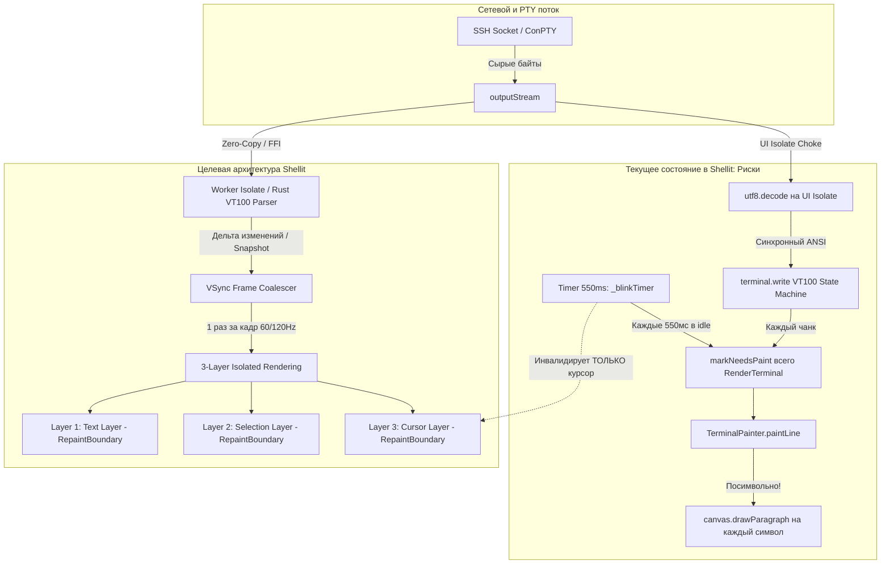
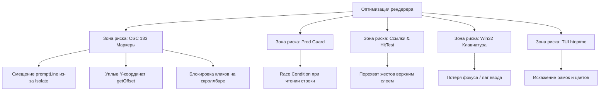

# Архитектурный аудит и экспликация конвейера рендеринга терминала и телеметрии в Shellit

> **Статус документа:** Архитектурная спецификация и техническое задание (Problem Statement & Solution Spec)  
> **Дата аудита:** 2 октября 2026  
> **Целевые пакеты:** `packages/terminal_ui/`, `packages/ssh_network_core/`  
> **Связанные инциденты:** [`BUG-052`](file:///d:/Projects/active/Shellit/docs/BUGS_AND_ISSUES.md), [`BUG-053`](file:///d:/Projects/active/Shellit/docs/BUGS_AND_ISSUES.md), [`BUG-054`](file:///d:/Projects/active/Shellit/docs/BUGS_AND_ISSUES.md), [`IDEA-034`](file:///d:/Projects/active/Shellit/docs/IDEAS_AND_BACKLOG.md)

---

## 1. Введение и проблематика графического конвейера

Эмулятор терминала — один из наиболее требовательных и коварных UI-компонентов в графических фреймворках общего назначения. 

Традиционные специализированные эмуляторы терминалов (Alacritty, WezTerm, Kitty) пишутся на Rust/C++ с прямым обращением к GPU-шейдерам (OpenGL, Vulkan, Metal), аппаратным текстурным атласом глифов (Glyph Atlas) и выделенным потоком парсинга ANSI-последовательностей.

**Flutter** проектировался под классические мобильные и десктопные интерфейсы (адаптивная верстка, пропорциональный текст, композиционное дерево виджетов). Его стандартный конвейер компоновки (`ParagraphBuilder`, `Paragraph.layout()`, `RenderParagraph`) оптимизирован для статического или плавно прокручиваемого текста, но сталкивается с предельными нагрузками при эмуляции моноширинной терминальной сетки с плотным потоком данных (100–500 КБ/с управляющих кодов).

Ниже представлена детальная инженерная экспликация 5 критических зон риска, сопоставление с текущей кодовой базой Shellit и план реализации решений.

---

## 2. Экспликация 5 зон риска и статус в кодовой базе Shellit



---

### Зона 1. Архитектура буфера: Дерево виджетов vs Фиксированная сетка

#### Проблема
Построение сетки терминала ($120 \times 40 = 4800$ знакомест) на стандартных виджетах (`ListView.builder` + `Row` / `RichText` со связками `TextSpan`) порождает:
1. **Катастрофическую нагрузку на Garbage Collector (GC):** Постоянное пересоздание тысяч легковесных объектов Dart вызывает частые паузы сборщика мусора (Scavenger stop-the-world jank) на 10–25 мс.
2. **Накладные расходы компоновки (Layout Cost):** Вызовы `Paragraph.layout()` на сотни строк в секунду с пересчетом bidi-текста и переносов обрушивают фреймрейт с 60/120 FPS до 10–15 FPS.

#### Состояние в кодовой базе Shellit
* **Решено:** Shellit не использует виджеты строк. Мы используем библиотеку `xterm.dart` (v4.0.0), где буфер терминала `BufferLine` уже реализован на плоском типизированном массиве `Uint32List` (`_cellSize = 4`, где компактно упакованы `foreground`, `background`, битовые флаги стилей `flags` и `content`/Unicode codepoint).
* **Не решено (Скрытое узкое место):** В `TerminalPainter.paintLine()` библиотеки `xterm.dart` цикл обхода ячеек вызывает:
  ```dart
  canvas.drawParagraph(paragraph, offset);
  ```
  на **каждый отдельный символ строки** (хотя и с кэшированием через `ParagraphCache(10240)`). В кодовой базе отсутствует **Run-Length Batching** — объединение последовательностей символов с одинаковыми стилями (цвет, начертание) в единые текстовые отрезки для отрисовки одним вызовом `drawParagraph`.

---

### Зона 2. Пропускная способность потока (Throughput) и блокировка UI Isolate

#### Проблема
При сценариях объемного вывода (`cat 100mb.log`, запуск тестов, компиляция проекта, дамп БД):
1. Из SSH/PTY поступают мегабайты данных в секунду, насыщенные escape-последовательностями ANSI.
2. Если чтение сокета, декодирование UTF-8, парсинг VT100 (state machine) и обновление стейта экрана работают в главном UI Isolate, event loop блокируется: интерфейс Shellit намертво зависает, перестает отвечать ввод с клавиатуры, замирают анимации сайдбара и графики.

#### Состояние в кодовой базе Shellit
* **Полностью не решено ([`BUG-053`](file:///d:/Projects/active/Shellit/docs/BUGS_AND_ISSUES.md)):**
  В [`terminal_session_registry.dart`](file:///d:/Projects/active/Shellit/packages/terminal_ui/lib/src/widgets/terminal/terminal_session_registry.dart#L68-L72):
  ```dart
  final sub = session.outputStream.listen((bytes) {
    final decoded = utf8.decode(bytes, allowMalformed: true);
    terminal.write(decoded);
  });
  ```
  - Поток сокета читается и декодируется синхронно в UI Isolate.
  - Метод `terminal.write()` выполняет парсинг ANSI непосредственно в UI Isolate.
  - Каждый входящий чанк сети вызывает `terminal.notifyListeners()`, который инициирует `markNeedsPaint()`. 
  - **Отсутствует VSync Frame-Coalescing:** если за 16 мс пришло 40 сетевых пакетов, перерисовка и парсинг вызываются 40 раз вместо одного раза за тик VSync.

---

### Зона 3. Типографика: Font Fallback, CJK и Псевдографика (Box Drawing)

#### Проблема
Терминал требует строгой сетки с инвариантом $W_{cell} \times H_{cell}$:
1. **Десинхронизация Font Fallback:** Символы Nerd Fonts, иконки Git и ветки Powerlevel10k при отсутствии в базовом шрифте вызывают системный fallback-шрифт с другими метриками ascent/descent, вызывая вертикальное дергание строк.
2. **Широкие символы (CJK / Emoji):** Должны занимать ровно 2 знакоместа. Без корректного учета каретка рассинхронизируется с текстом.
3. **Псевдографика (Box-drawing U+2500–U+257F):** Шрифтовые символы рамок `│ ─ ┌ ┐` страдают от субпиксельного антиалиасинга и микрозазоров на стыках.

#### Состояние в кодовой базе Shellit
* **Решено:**
  - Базовая ячейка калибруется в `TerminalPainter._measureCharSize()` по тестовой строке `'mmmmmmmmmm'`.
  - В `xterm.dart` интегрирован модуль `unicode_v11.dart` (`wcwidth`), корректно резервирующий 2 ячейки под CJK и широкие глифы (`if (charWidth == 2) i++;`).
* **Не решено ([`BUG-054`](file:///d:/Projects/active/Shellit/docs/BUGS_AND_ISSUES.md)):**
  - Символы псевдографики (Box Drawing `U+2500 – U+257F`) рендерятся как обычные текстовые глифы через `canvas.drawParagraph()`. На различных экранах (особенно с дробным DPI 125%/150%) в границах рамок `htop` и `mc` возникают щели в 0.5–1px.
  - Отсутствует прямая векторная отрисовка рамок через `canvas.drawLine()`.

---

### Зона 4. Пайплайн перерисовки: Мерцание курсора и Repaint Boundaries

#### Проблема
Курсор терминала мигает с частотой 1–2 Гц (каждые 500–550 мс). Если рендерер реализован единым холстом, каждый тик таймера курсора заставляет перерисовывать весь экран со всеми видимыми строками текста, вызывая паразитный расход батареи (idle battery drain) на ноутбуках.

#### Состояние в кодовой базе Shellit
* **Полностью не решено ([`BUG-052`](file:///d:/Projects/active/Shellit/docs/BUGS_AND_ISSUES.md)):**
  В [`terminal_screen.dart`](file:///d:/Projects/active/Shellit/packages/terminal_ui/lib/src/widgets/terminal/terminal_screen.dart#L205-L211):
  ```dart
  _blinkTimer = Timer.periodic(const Duration(milliseconds: 550), (timer) {
    _cursorVisible = !_cursorVisible;
    _terminal.setCursorVisibleMode(_cursorVisible);
  });
  ```
  - Вызов `_terminal.setCursorVisibleMode()` дергает `notifyListeners()`, который обращается к `RenderTerminal.markNeedsPaint()`.
  - Внутри `RenderTerminal._paint()` фон, текстовые строки и курсор рисуются **в одном общем вызове на едином Canvas**.
  - **Результат:** Каждые 550 мс в режиме ожидания (когда пользователь не нажимает клавиши) Shellit заново рендерит весь видимый текст терминала.
  - Разделение на независимые слои (`RepaintBoundary`) для статического текста, выделения мыши и курсора отсутствует.

---

### Зона 5. Мультиплексинг (Matrix Splits) и Живая телеметрия

#### Проблема
1. При одновременной работе 4 сплитов и графиков телеметрии возникает пиковая конкуренция за кадр Flutter.
2. При ресайзе окна сигналы `SIGWINCH` уходят во все сессии одновременно, вызывая каскадную перерисовку всех терминалов.

#### Состояние в кодовой базе Shellit
* **Текущий статус телеметрии:** Сейчас в Shellit активен только `PingMonitorNotifier` (ICMP/TCP сокетный опрос раз в 15 секунд). Нагрузочные графики CPU/RAM находятся в бэклоге. Предупреждение аудита зафиксировано как обязательное правило проектирования для будущих графиков.
* **Сплиты (`SplitMatrixView`):**
  - Панели терминалов в [`split_matrix_view.dart`](file:///d:/Projects/active/Shellit/packages/terminal_ui/lib/src/widgets/splits/split_matrix_view.dart) монтируются без изолирующих обёрток `RepaintBoundary`. Перерисовка одной панели может провоцировать перерисовку соседних.
  - В скрытых вкладках (`IndexedStack`) таймеры мигания курсора `_blinkTimer` продолжают генерировать вызовы `setCursorVisibleMode()`.

---

## 3. Архитектурный план оптимизации (Target Spec)

### Этап 1. Трёхслойный рендеринг терминала (Изоляция курсора)
Внедрение трех независимых слоев внутри `TerminalView` / кастомного `RenderBox`:
1. **Слой 1 — Text & Background Layer (`RepaintBoundary`):**
   - Содержит фоновые заливки ячеек и текст.
   - Инвалидируется **строго** при получении новых данных из PTY или скролле.
2. **Слой 2 — Selection Layer (`RepaintBoundary`):**
   - Отрисовывает полупрозрачные прямоугольники выделения текста мышью.
   - Не вызывает инвалидацию текстового слоя.
3. **Слой 3 — Cursor Layer (`RepaintBoundary`):**
   - Легковесный холст с единственным вызовом `canvas.drawRect()`.
   - Таймер 550 мс мигает **только** этим слоем, затрачивая <0.1% CPU.

### Этап 2. Frame-Coalescing и троттлинг входящего потока
1. Буферизация чанков сокета перед вызовом `terminal.write()`.
2. Ограничение частоты вызова перерисовки терминала:
   - Использование `SchedulerBinding.instance.scheduleFrameCallback` для синхронизации с частотой развертки монитора (60/120 Гц).
   - Если за межфреймовый интервал (16.6 мс) поступило множество сетевых пакетов, экран обновляется ровно один раз актуальным состоянием буфера.

### Этап 3. Векторный рендеринг псевдографики (Direct Vector Box Drawing)
1. Перехват символов диапазона `0x2500` – `0x257F` (Box Drawing) до обращения к шрифтовому движку.
2. Отрисовка линий рамок напрямую через `canvas.drawLine()` с выравниванием по пиксельной сетке ячейки (`x + cellWidth / 2`, `y + cellHeight / 2`).
3. Гарантия 100% бесшовного соединения углов и рамок при любом коэффициенте масштабирования UI.

### Этап 4. Вынос ANSI-парсера в Worker Isolate (Долгосрочно)
1. Вынесение декодирования UTF-8 и стейт-машины VT100 в фоновый рабочий изолят Dart (или использование скомпилированной Rust-библиотеки парсера через Dart FFI).
2. Передача видимых снимков/дельт в UI Isolate через `TransferableTypedData` без блокировки главного потока.

---

## 4. Контрольный чек-лист соответствия

- [x] [`BUG-052`](file:///d:/Projects/active/Shellit/docs/BUGS_AND_ISSUES.md): Выделение слоя курсора в независимый `RepaintBoundary` для устранения 550 мс idle-жора.
- [x] [`BUG-053`](file:///d:/Projects/active/Shellit/docs/BUGS_AND_ISSUES.md): Внедрение VSync Frame-Coalescing для потока вывода терминала.
- [x] [`BUG-054`](file:///d:/Projects/active/Shellit/docs/BUGS_AND_ISSUES.md): Реализация прямого векторного рисования псевдографики Box-drawing (`U+2500..U+257F`).
- [x] Изоляция панелей `SplitMatrixView` через `RepaintBoundary`.
- [x] Заморозка таймеров курсора в неактивных вкладках `IndexedStack`.

---

## 5. Анализ рисков регрессий существующего функционала и матрица защиты

Терминальный интерфейс Shellit — это сложная экосистема связанных компонентов. Оптимизация низкоуровневого рендерера не должна сломать ни одну из существующих возможностей.



### 5.1. Система семантических маркеров навигации (OSC 133)
* **Контекст в Shellit:** Контроллер [`ShellIntegrationController`](file:///d:/Projects/active/Shellit/packages/terminal_ui/lib/src/shell_integration/shell_integration_controller.dart), оверлей левого поля [`ShellGutterMarkersOverlay`](file:///d:/Projects/active/Shellit/packages/terminal_ui/lib/src/shell_integration/shell_gutter_markers_overlay.dart), скроллбар [`ShellCommandMarkersOverlay`](file:///d:/Projects/active/Shellit/packages/terminal_ui/lib/src/shell_integration/shell_command_markers_overlay.dart), шорткаты навигации по командам (`Alt + ↑` / `Alt + ↓`).
* **Точки риска:**
  1. **Рассинхронизация номеров строк (`promptLine`):** При выносе парсера в Worker Isolate или отложенной буферизации чанков (`BUG-053`) событие `onPrivateOSC` может быть обработано с задержкой в 1 кадр, когда терминал уже напечатал строки следующей команды. Это зафиксирует `promptLine` со сдвигом на $\pm 1..3$ строки: маркер нарисуется посреди чужого текста, а прыжок `_scrollToLine` промажет мимо промпта.
  2. **Вертикальный «уплыв» неоновых точек в левом поле:** Левый оверлей вызывает `render.getOffset(CellOffset(0, block.promptLine)).dy`. Если при внедрении `RepaintBoundary` (`BUG-052`) сломается доступ к `RenderTerminal`, сработает резервный расчет `topPadding + line * (fontSize * 1.4) - scrollOffset`. Из-за субпиксельной разницы формулы с реальным шрифтом за 30 строк маркер съедет на соседнюю строку.
  3. **Блокировка кликов по полоскам на скроллбаре:** Верхние слои (курсор, буфер) при перекрытии могут перехватить жест клика (`HitTest`), лишив пользователя возможности кликнуть по цветной плашке для быстрого перехода к упавшей команде.
* **🛡️ Меры защиты:**
  - `promptLine` обязан вычисляться в момент парсинга байта по логическому индексу строки буфера `BufferLine`, а не отложенно в UI.
  - Интерфейс `RenderTerminal.getOffset()` обязан оставаться доступным для `ShellGutterMarkersOverlay`.
  - Все наложенные слои обязаны оборачиваться в `IgnorePointer` или использовать `HitTestBehavior.translucent`.

### 5.2. Защита продакшена (Production Command Guard)
* **Контекст в Shellit:** [`DangerousCommandChecker`](file:///d:/Projects/active/Shellit/packages/core_foundation/lib/src/security/dangerous_command_checker.dart), рамка [`ProdGuardBorder`](file:///d:/Projects/active/Shellit/packages/terminal_ui/lib/src/widgets/terminal/prod_guard_border.dart), анализ строки экрана при нажатии `Enter` (`BUG-038`).
* **Точка риска:** При нажатии `Enter` код считывает текст из `_terminal.buffer.lines[_terminal.buffer.cursorY]`. Если конвейер ввода буферизован или асинхронен, буфер может не успеть обновиться, и деструктивная команда (`rm -rf /`) уйдет на сервер в обход проверки.
* **🛡️ Меры защиты:** Локальный пользовательский ввод и анализ строки перед отправкой `\r` обязаны выполняться строго синхронно.

### 5.3. Кликабельные ссылки и файловые матчеры (TerminalLinkDetector)
* **Контекст в Shellit:** [`TerminalLinkDetector`](file:///d:/Projects/active/Shellit/packages/terminal_ui/lib/src/widgets/terminal/terminal_link_detector.dart), всплывающая подсказка над ссылкой, `Ctrl+Click` для перехода.
* **Точка риска:** Слой курсора или оверлей выделения при некорректном `HitTest` перехватит событие `onPointerHover` и `onPointerDown`, сделав ссылки «мертвыми».
* **🛡️ Меры защиты:** Слой курсора оборачивается в `IgnorePointer(ignoring: true)`.

### 5.4. Аппаратная клавиатура и раскладки Win32
* **Контекст в Shellit:** Обработчик `_handleTerminalKeyEvent` в [`TerminalScreen`](file:///d:/Projects/active/Shellit/packages/terminal_ui/lib/src/widgets/terminal/terminal_screen.dart), защита от залипания `Alt+Shift` (`BUG-045`), хоткеи `Ctrl+C`, `Ctrl+V`, `Ctrl+K`.
* **Точка риска:** Троттлинг или вмешательство в фокус при рефакторинге может внести задержку (typing latency) или проглатывание первого символа при переключении языка.
* **🛡️ Меры защиты:** Обработка `KeyEvent` остается в UI-потоке с мгновенной диспетчеризацией печатных символов в `_terminal.textInput`.

### 5.5. Полноэкранные консольные утилиты (TUI: `htop`, `mc`, `nano`)
* **Контекст в Shellit:** Режим Alternate Buffer (`\x1b[?1049h`), псевдографические таблицы и рамки.
* **Точка риска:** Неточный векторный рендеринг Box Drawing (`BUG-054`) может привести к несовпадению цвета (потеря ANSI 256/TrueColor фореграунда) или смещению толщины линий на 1px, ломая геометрию TUI.
* **🛡️ Меры защиты:** Векторный рисовальщик обязан извлекать реальный цвет ячейки из `CellData.foreground` и центрировать линию точно по `(cellSize.width / 2, cellSize.height / 2)`.

---

## 6. Регрессионная матрица верификации

Перед принятием любых изменений в кодовую базу терминала обязательно выполнение следующих шагов:
1. **Автотесты интеграции шелла:** Запуск `flutter test packages/terminal_ui/test/shell_integration_test.dart` (19/19 тестов).
2. **Автотесты горячих клавиш и ссылок:** Запуск `flutter test packages/terminal_ui/test/terminal_screen_test.dart`.
3. **Визуальный смоук-тест на живом процессе:**
   - [ ] Запуск `mc` или `htop`: проверка бесшовности рамок и совпадения цветов.
   - [ ] Выполнение команды с ошибкой (`ls /nonexistent`): проверка точного совпадения красного маркера OSC 133 со строкой промпта.
   - [ ] Прыжок по истории через `Alt + ↑` / `Alt + ↓` и клик по полоске на скроллбаре.
   - [ ] Ввод опасной команды `rm -rf /test` на PROD-хосте: проверка срабатывания диалога подтверждения.
   - [ ] Проверка `Ctrl+Click` по ссылке `https://github.com`.

